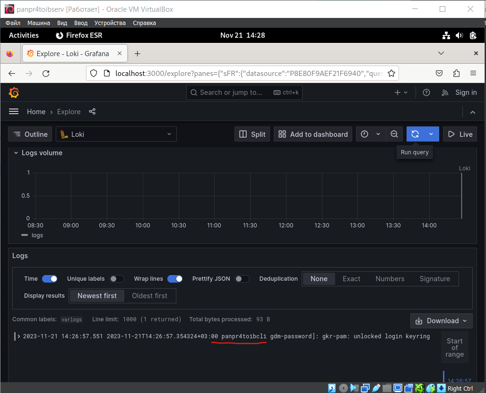
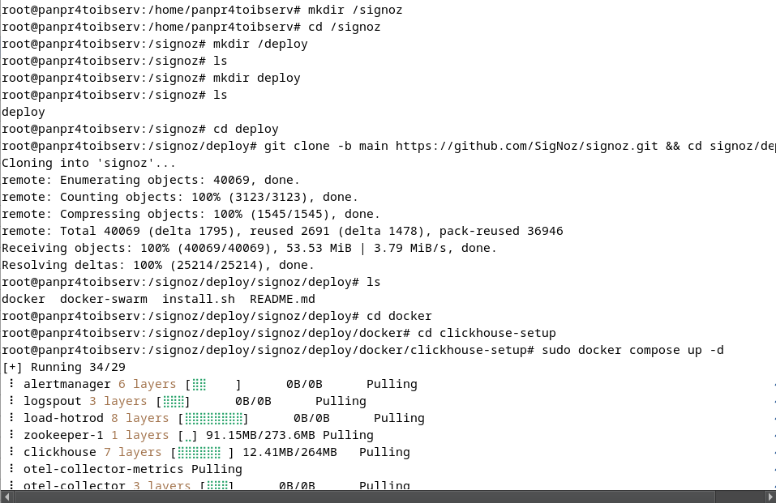
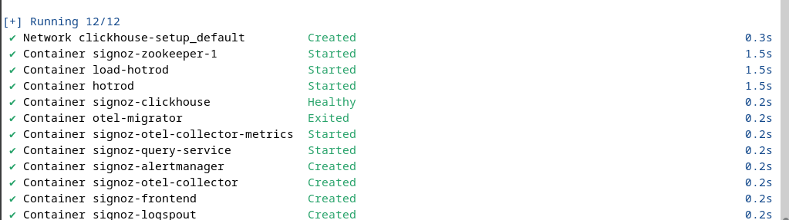
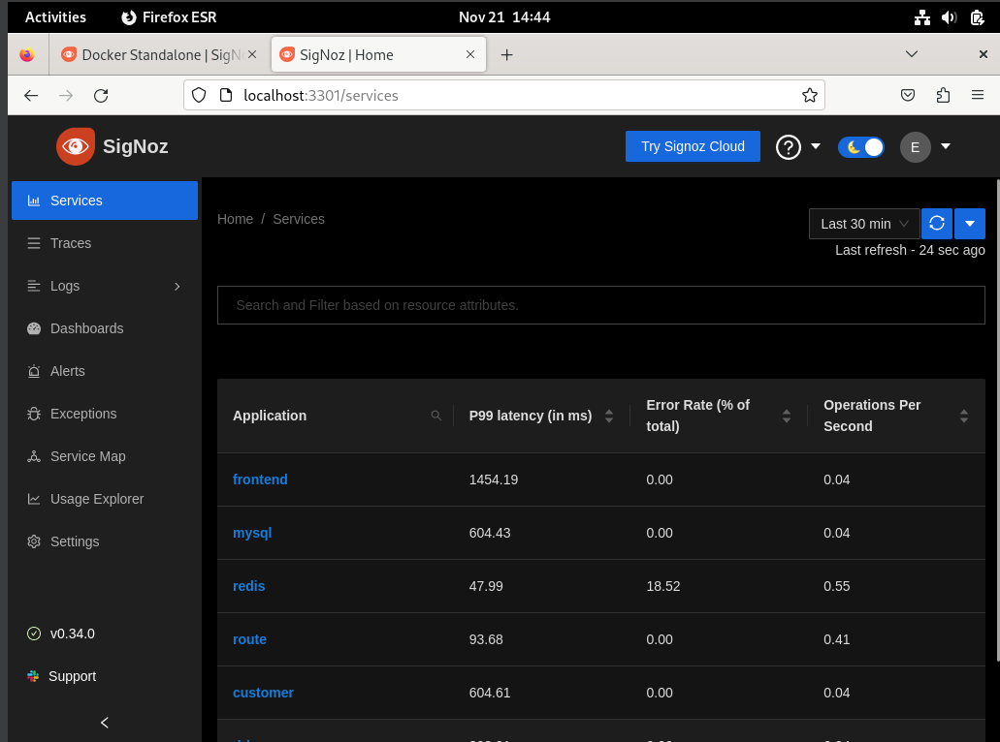
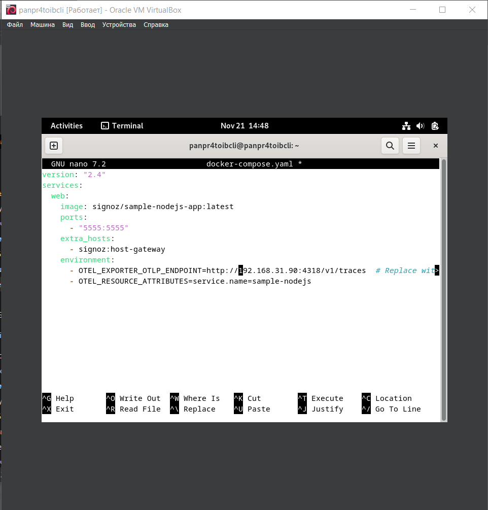
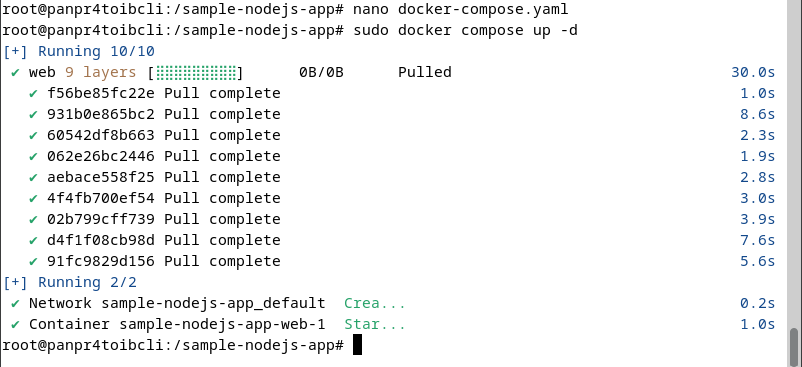
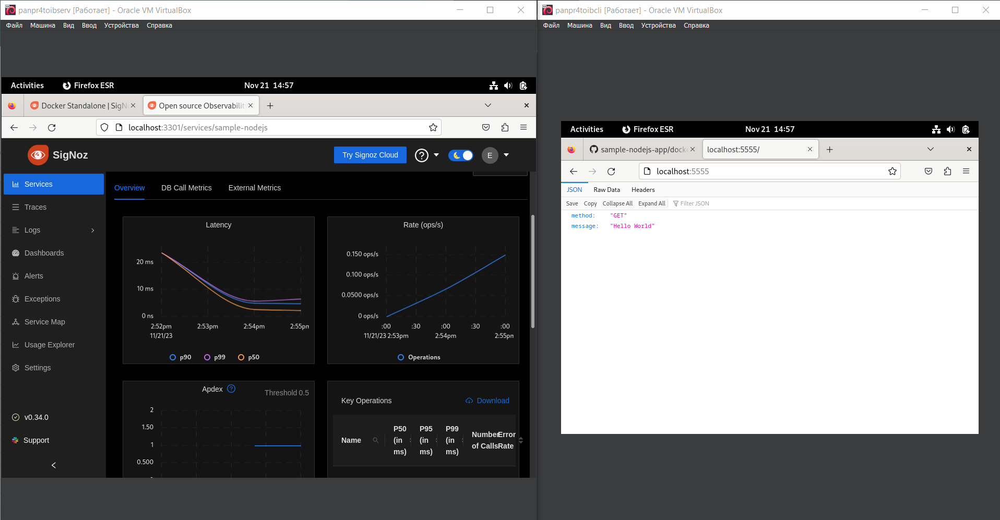
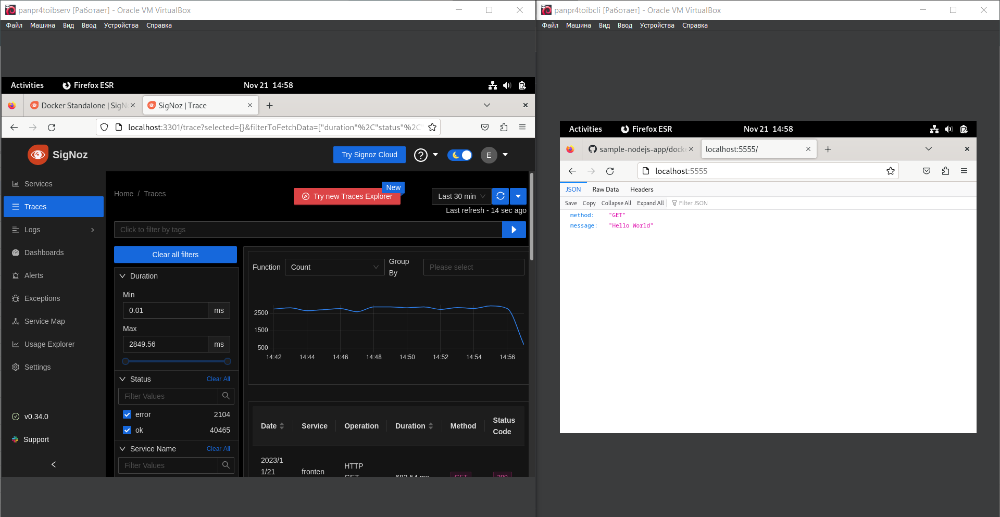

# TOIB-PR-3 Pankov Evgeniy Romualdovich BBMO-02-23

1. Создаем 2 виртуальные машины на базе ОС Debian 12 и обеспечиваем между ними сетевой обмен

   

   

   
   
2. Включаем на 1й (сервер) из ВМ передачу логов по протоколу rsyslog на 2ю ВМ (клиент)
   
   **Устанавливаем и настраиваем rsyslog на сервере и клиенте**

   

   **Проверяем работоспособность rsyslogна сервере и клиенте**

   

   **Включаем UDP и TCP соединение**

   

   **Устанавливаем правила на сервере**
   

   **Установливаем правила на клиенте**
   
   

   **Проверяем получения логов на сервере**
   
   

   

3. Установить и настроить получение логов на сервер с использованием Loki
   
   **Установливаем и редактируем compose-файл на сервере**
 
   
   
   
   **Запускаем Loki**
 
   
 
   **Редактируем promtail на клиенте**
 
   

   **Редактируем compose-файл для promtail**
 
   
  
   **Запускаем promtail на клиенте**
 
   

   **Просматриваем логи клиента в Grafana**
 
   

   
 
 4. Устанавливаем и настроиваем получение логов на сервере с использованием Signoz

   _Установка происходит по инструкции с сайта: https://signoz.io/docs/install/docker/#install-signoz-using-docker-compose_

   **Запускаем Signoz**
   
   
   
   
   
   
   
   **Редактируем конфигурации на клиенте для отправки данных в Signoz**
   
   _Устнаовка приложения согласно инструкции с сайта: https://github.com/SigNoz/sample-nodejs-app/_
   
   

   **Запускаем клиентское приложение**
   
   
   
   **Проверяем получение логов в Signoz**
   
   
   
   
